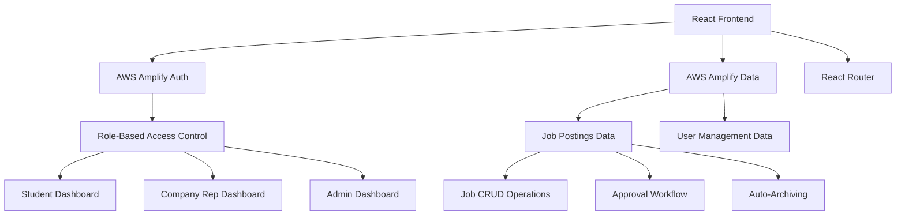
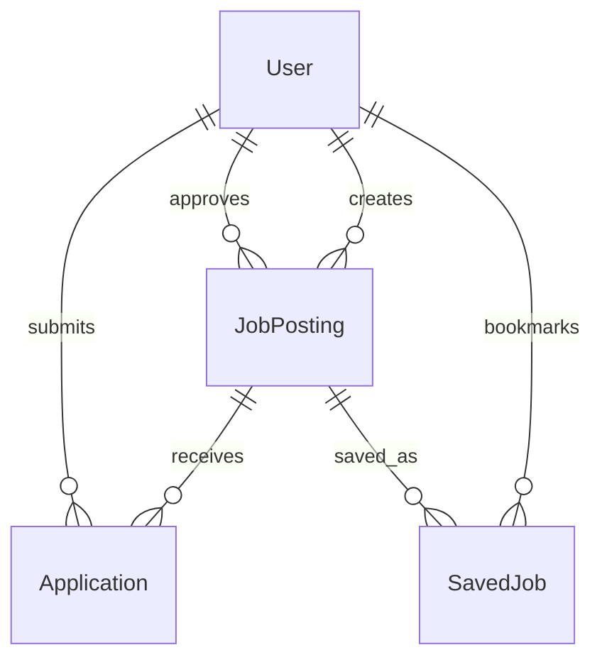

# Design Document

## Overview

The Student Job Board is a React-based web application built on AWS Amplify that serves MIS (Management Information Systems) students and connects them with relevant job opportunities. The design leverages modern React patterns, TypeScript for type safety, and AWS Amplify for authentication and data management. The architecture supports role-based access control with simplified user roles (Student, Company Representative, Admin), comprehensive job posting workflows, and scalable component organization.

The application follows a mobile-first, accessible design approach with clean, professional styling that reflects the academic environment while maintaining ease of use for all user types. The platform is specifically tailored for MIS curriculum and career paths.

## Architecture

### High-Level Architecture



### Component Architecture

The application follows a hierarchical component structure with clear separation of concerns:

- **App Level**: Authentication, routing, and global state management
- **Layout Level**: Navigation, headers, and role-based UI shells
- **Page Level**: Dashboard views for each user role
- **Feature Level**: Job posting, job browsing, user management components
- **UI Level**: Reusable form elements, cards, buttons, and utility components

### Data Flow

1. **Authentication Flow**: User signs in → AWS Amplify Auth → Role determination → Route to appropriate dashboard
2. **Job Posting Flow**: Create/Edit → Validation → Approval (if required) → Publish → Auto-archive on deadline
3. **Job Browsing Flow**: Fetch active jobs → Apply filters → Display results → Handle interactions
4. **Admin Flow**: Manage users → Oversee postings → Review analytics → Maintain platform

## Components and Interfaces

### Core Components

#### Authentication Components
- **SignInPage**: Main authentication interface with email/password form
- **AuthGuard**: Higher-order component for route protection
- **RoleProvider**: Context provider for user role management

#### Layout Components
- **AppLayout**: Main application shell with navigation
- **Navigation**: Role-based navigation menu
- **Header**: Application header with user info and logout
- **Sidebar**: Contextual navigation for complex pages

#### Job Management Components
- **JobBoard**: Main job listing interface for students
- **JobCard**: Individual job posting display component
- **JobPostingForm**: Comprehensive form for creating/editing jobs
- **JobDetails**: Detailed view of individual job postings
- **JobFilters**: Search and filtering interface
- **ApprovalQueue**: Interface for admin to review pending posts

#### User Management Components
- **UserDashboard**: Role-specific dashboard views
- **UserManagement**: Admin interface for managing users and roles
- **ProfileSettings**: User profile and preferences management
- **MISAccountCreation**: Simplified account creation for MIS students without major selection

#### Utility Components
- **LoadingSpinner**: Consistent loading states
- **ErrorBoundary**: Error handling and display
- **Modal**: Reusable modal component
- **Toast**: Notification system
- **FormField**: Standardized form input components

### Data Interfaces

#### User Interface
```typescript
interface User {
  id: string;
  email: string;
  role: 'student' | 'company_rep' | 'admin';
  firstName: string;
  lastName: string;
  graduationYear?: number; // For MIS students

  company?: string; // For company representatives
  createdAt: string;
  lastLogin: string;
}
```

#### Job Posting Interface
```typescript
interface JobPosting {
  id: string;
  title: string;
  companyName: string;
  industry: string;
  jobType: 'internship' | 'full-time' | 'contract';
  description: string;
  responsibilities: string[];
  requiredSkills: string[];
  preferredSkills?: string[];
  applicationDeadline: string;
  contactMethod: ContactMethod;
  postedBy: string;
  approvedBy?: string;
  status: 'draft' | 'pending' | 'approved' | 'archived';
  createdAt: string;
  updatedAt: string;
  viewCount: number;
  applicationCount: number;
}

interface ContactMethod {
  type: 'email' | 'careers_page' | 'phone';
  value: string;
  instructions?: string;
}
```

### API Interfaces

#### Job Management API
- `getActiveJobs()`: Retrieve all active job postings
- `getJobById(id)`: Get detailed job information
- `createJob(jobData)`: Create new job posting
- `updateJob(id, jobData)`: Update existing job posting
- `deleteJob(id)`: Remove job posting
- `approveJob(id)`: Approve pending job posting
- `archiveJob(id)`: Manually archive job posting

#### User Management API
- `getCurrentUser()`: Get current user information
- `updateUserRole(userId, role)`: Admin function to change user roles
- `getUsersByRole(role)`: Get users by specific role
- `trackJobView(jobId)`: Record job view for analytics

## Data Models

### Database Schema

The application uses AWS Amplify DataStore with the following models:

#### User Model
- Stores user authentication and profile information
- Links to AWS Cognito for authentication
- Includes role-based permissions and department/company affiliations

#### JobPosting Model
- Comprehensive job posting information
- Includes approval workflow status
- Supports automatic archiving based on deadline
- Tracks engagement metrics

#### Application Model (Future Enhancement)
- Links students to job postings
- Tracks application status and communication
- Supports internal messaging system

### Data Relationships



### MIS-Specific Design Considerations

#### Account Creation Simplification
- **No Major Selection**: Since the platform is MIS-focused, students don't need to specify their major
- **Graduation Year Focus**: Collect graduation year to help with internship vs full-time job targeting
- **MIS Curriculum Alignment**: Job categories and skills align with MIS coursework and career paths

#### Job Posting Optimization
- **MIS-Relevant Categories**: Job types and industries relevant to MIS graduates
- **Skills Taxonomy**: Pre-defined skill sets that align with MIS curriculum
- **Career Path Guidance**: Job postings categorized by typical MIS career trajectories

## Error Handling

### Error Categories

1. **Authentication Errors**: Invalid credentials, expired sessions, unauthorized access
2. **Validation Errors**: Form validation, required field errors, format validation
3. **Network Errors**: API failures, connectivity issues, timeout errors
4. **Permission Errors**: Role-based access violations, insufficient permissions
5. **Data Errors**: Missing records, data corruption, constraint violations

### Error Handling Strategy

- **Global Error Boundary**: Catches and displays unexpected errors
- **Form Validation**: Real-time validation with clear error messages
- **API Error Handling**: Consistent error response handling with user-friendly messages
- **Retry Mechanisms**: Automatic retry for transient network errors
- **Fallback UI**: Graceful degradation when features are unavailable

### Error Display Patterns

- **Inline Errors**: Form field validation errors
- **Toast Notifications**: Success/error messages for actions
- **Error Pages**: Full-page errors for critical failures
- **Loading States**: Clear indication of processing states

## Testing Strategy

### Testing Pyramid

#### Unit Tests (70%)
- Component rendering and behavior
- Utility function testing
- Form validation logic
- Data transformation functions
- Role-based access control logic

#### Integration Tests (20%)
- Component interaction testing
- API integration testing
- Authentication flow testing
- Route navigation testing
- Form submission workflows

#### End-to-End Tests (10%)
- Complete user workflows
- Cross-browser compatibility
- Accessibility compliance
- Performance benchmarks
- Critical path validation

### Testing Tools and Frameworks

- **Jest**: Unit testing framework
- **React Testing Library**: Component testing utilities
- **MSW (Mock Service Worker)**: API mocking for tests
- **Cypress**: End-to-end testing framework
- **Axe**: Accessibility testing integration

### Test Coverage Goals

- **Component Coverage**: 90% of components have unit tests
- **Function Coverage**: 95% of utility functions tested
- **Integration Coverage**: All major user flows tested
- **Accessibility Coverage**: All interactive elements tested for accessibility

### Testing Scenarios

#### Authentication Testing
- Valid/invalid login attempts
- Role-based route access
- Session management and expiration
- Password reset workflows

#### Job Management Testing
- Job posting creation and validation
- Approval workflow testing (admin approval)
- Search and filtering functionality
- Auto-archiving behavior
- MIS-specific job categorization and filtering

#### User Interface Testing
- Responsive design across devices
- Keyboard navigation
- Screen reader compatibility
- Form accessibility

## Security Considerations

### Authentication and Authorization
- AWS Cognito integration for secure authentication
- Role-based access control (RBAC) implementation
- JWT token management and refresh
- Session timeout and security

### Data Protection
- Input validation and sanitization
- XSS prevention measures
- CSRF protection
- Secure API communication (HTTPS)

### Privacy and Compliance
- User data protection
- GDPR compliance considerations
- Data retention policies
- Audit logging for administrative actions

## Performance Optimization

### Frontend Performance
- Code splitting by route and role
- Lazy loading of non-critical components
- Image optimization and lazy loading
- Bundle size optimization

### Data Loading Strategies
- Pagination for job listings
- Caching of frequently accessed data
- Optimistic updates for better UX
- Background data synchronization

### Accessibility Performance
- Semantic HTML structure
- ARIA labels and descriptions
- Keyboard navigation optimization
- Screen reader performance

## Deployment and Infrastructure

### AWS Amplify Configuration
- Frontend hosting on Amplify
- Automatic CI/CD pipeline
- Environment-specific configurations
- Custom domain setup

### Environment Management
- Development, staging, and production environments
- Environment-specific feature flags
- Configuration management
- Monitoring and logging setup

## Future Enhancement Considerations

### Phase 2 Features
- Internal messaging system
- Advanced analytics dashboard
- Mobile application
- Integration with external job boards

### Scalability Preparations
- Microservices architecture readiness
- Database optimization strategies
- CDN implementation
- Load balancing considerations

### Integration Possibilities
- LinkedIn integration
- University system integration
- Email notification system
- Calendar integration for deadlines